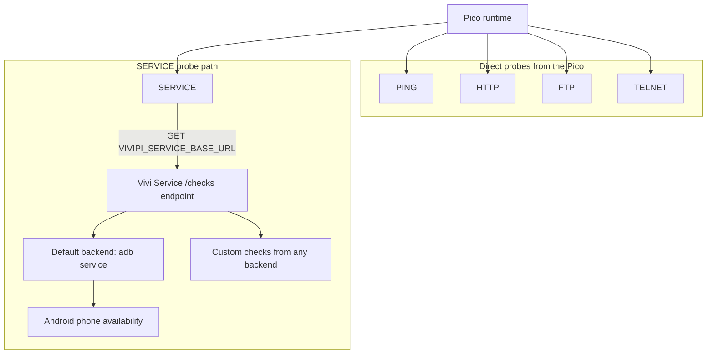

# ViviPi

[](https://github.com/chrisgleissner/vivipi/actions/workflows/ci.yml)
[](https://codecov.io/gh/chrisgleissner/vivipi)
[](https://www.gnu.org/licenses/gpl-3.0.en.html)
[](https://github.com/chrisgleissner/vivipi/releases)
[](https://github.com/chrisgleissner/vivipi)

ViviPi (pronounced "VEE-vee-pie", from the Latin *viv-* in *vivere*, "to live") is a minimal, glanceable monitoring system for Raspberry Pi Pico display modules. The default target is a Pico 2W with a 128x64 SH1107 OLED, but the runtime and build pipeline also support Waveshare Pico OLED, LCD, and e-paper modules.

The project is intentionally narrow:

- deterministic fixed-width rendering across supported Pico OLED, LCD, and e-paper modules
- deterministic scheduling and execution for `PING`, `HTTP`, `FTP`, `TELNET`, and `SERVICE`
- one `./build` entrypoint for install, lint, test, coverage, packaging, deploy, and service hosting

Behavioral requirements live in [docs/spec.md](docs/spec.md). Requirement-to-test coverage lives in [docs/spec-traceability.md](docs/spec-traceability.md).

> [!NOTE]
> This project is under active development. Some documented features may not yet be fully functional.

## System Architecture

ViviPi runs on the Pico and evaluates checks through two paths: direct network probes (`PING`, `HTTP`, `FTP`, `TELNET`) and `SERVICE` probes.



Direct probes run from the Pico itself. `SERVICE` is the extension point for any kind of check driven not by the Pico, but by another device.

## Operational Safety

- Missing or malformed device runtime config no longer aborts startup; the firmware boots with a bounded fallback config and surfaces diagnostics when a display path is available.
- If a configured display backend fails to initialize, firmware falls back to the default SH1107 OLED path when possible. If no backend can be started, the runtime stays headless and remains inspectable from the REPL surfaces.
- Direct transport probes classify transient failures as `timeout`, `dns`, `refused`, `network`, `reset`, or `io`, and use bounded retry with deterministic backoff before reporting failure.

### Probe Reference

| Probe | Performs | Success condition | Failure condition or note |
| --- | --- | --- | --- |
| `PING` | ICMP ping | Response received; latency measured locally | No response or timeout |
| `HTTP` | HTTP request | Response status is `2xx` or `3xx`; latency measured locally | Non-`2xx`/`3xx` response or timeout |
| `FTP` | FTP control session with optional credentials | Login succeeds and the top-level directory can be listed via passive mode | Login failure, invalid listing, or timeout |
| `TELNET` | Telnet session with optional credentials | Login succeeds when prompted and valid prompt or session output is observed | Login failure, invalid output, or timeout |
| `SERVICE` | HTTP request to a `/checks` endpoint | Response returns a valid checks payload; each returned check becomes an independent ViviPi check | Default backend uses `adb` to report Android availability, but any backend can return checks through the same schema |

## Default Hardware Target

- Board: Raspberry Pi Pico 2W
- Display: 128x64 monochrome OLED
- Display controller: SH1107
- Character grid: 16 columns x 8 rows using 8x8 bitmap cells
- Display interface: 4-wire SPI, mode 3
- Native transport mapping: portrait-native 64x128 SH1107 page stream with inferred column offset 32 for the Waveshare Pico OLED 1.3

### Pin Mapping

| Signal | GPIO |
| --- | --- |
| DIN | GP11 |
| CLK | GP10 |
| CS | GP9 |
| DC | GP8 |
| RST | GP12 |
| BTN A | GP14 |
| BTN B | GP15 |

## Quick Start

This is the shortest useful path from clone to running device.

Requirements:

- Python 3.12+
- `python3 -m venv`
- `adb` only if you want the default service against connected Android devices
- `mpremote` only if you want `./build deploy` to copy files onto a Pico 2W

For day-to-day editor workflows, copy `config/build-deploy.local.example.yaml` to `config/build-deploy.local.yaml` and put your Wi-Fi credentials there. `./build render-config`, `./build build-firmware`, and `./build deploy` automatically prefer that local file when it exists. Pass `--config config/build-deploy.yaml` when you need to bypass a sibling local override.

1. Set Wi-Fi credentials. Add `VIVIPI_SERVICE_BASE_URL` only if you want `SERVICE` checks.

```bash
export VIVIPI_WIFI_SSID="your-wifi-name"
export VIVIPI_WIFI_PASSWORD="your-wifi-password"
export VIVIPI_SERVICE_BASE_URL="http://192.168.1.10:8080/checks"
```

1. Run the default local workflow.

```bash
./build
```

`./build` with no command is equivalent to `./build ci`.

Without `VIVIPI_SERVICE_BASE_URL`, ViviPi builds only the direct `PING`, `HTTP`, `FTP`, and `TELNET` checks from [config/checks.yaml](config/checks.yaml).

1. Start the default Vivi Service only if you want the sample `SERVICE` check.

```bash
./build service --host 0.0.0.0 --port 8080
```

1. Build and deploy to the Pico when hardware is connected.

```bash
./build build-firmware
./build deploy
```

`./build deploy` uses `mpremote connect auto` to copy the prepared filesystem to the first connected Pico. Use `--device-port` only when you want a specific board. It does not flash a MicroPython UF2 onto a blank board.

## Editor Workflows

### Thonny

1. Create `config/build-deploy.local.yaml` from `config/build-deploy.local.example.yaml` or export the `VIVIPI_WIFI_*` environment variables.
2. Run `./build build-firmware`.
3. In Thonny, connect to `MicroPython (Raspberry Pi Pico)`.
4. Open `artifacts/release/vivipi-device-fs/` as the local source tree and upload its contents to the device root.
5. Re-run `./build build-firmware` whenever config or source changes, then re-upload the updated files.

The generated `artifacts/release/vivipi-device-fs/` directory is the exact device filesystem layout expected by the Pico.

### VS Code

The official Raspberry Pi Pico extension handles Pico toolchain setup, and its MicroPython workflow relies on the MicroPico extension. This repository includes workspace recommendations for both extensions plus ready-made tasks in `.vscode/tasks.json`.

1. Open the repository as a single-folder workspace.
2. Install the recommended extensions when prompted.
3. Create `config/build-deploy.local.yaml` from `config/build-deploy.local.example.yaml` for local Wi-Fi and optional service settings.
4. Run the `ViviPi: Build Firmware Bundle` task to regenerate `artifacts/release/vivipi-device-fs/`.
5. Run the `ViviPi: Deploy To First Connected Pico` task to build and upload to the first connected Pico.

If you have more than one board attached, use `./build deploy --device-port <port>` from the integrated terminal.

## Install Paths

### Develop From Source

Use the source checkout when you want the full local workflow:

```bash
./build install
./build test
./build build-firmware
./build service --host 0.0.0.0 --port 8080
```

The canonical entrypoint is `./build`. Run `./build help` for the full CLI surface.

### Install From GitHub Releases

Each GitHub release publishes a small, versioned set of assets. Download the files that match the tag you want to install.

| Asset | Purpose | Contains only what is needed for | How to use it |
| --- | --- | --- | --- |
| `vivipi-device-filesystem-<version>.zip` | Device update bundle | Copying ViviPi onto a Pico after the base MicroPython UF2 is already installed | Unzip or copy the contents onto the Pico with `mpremote fs cp` |
| `pico2w-micropython-<version>.txt` | Pinned board bootstrap reference | Finding the exact MicroPython download page and default board port used for the release | Read it first when preparing a blank Pico |
| `vivipi-service-bundle-<version>.zip` | Local service starter kit | Running the default ADB-backed service or a minimal custom `SERVICE` endpoint | Unzip it, install the bundled wheel, then run either `vivipi-adb-service` or `custom-service-example.py` |
| `vivipi-source-<version>.zip` | Tagged source snapshot | Inspecting or rebuilding the exact source used for the release | Download if you want a ZIP source archive with the release tag in the filename |
| `vivipi-source-<version>.tar.gz` | Tagged source snapshot | Inspecting or rebuilding the exact source used for the release | Download if you want a tarball source archive with the release tag in the filename |

#### Device Install From A Release

1. Download `pico2w-micropython-<version>.txt` and `vivipi-device-filesystem-<version>.zip` from the release page.
2. Use the URL in `pico2w-micropython-<version>.txt` to install the base MicroPython UF2 on the Pico if the board is blank.
3. Copy the contents of `vivipi-device-filesystem-<version>.zip` onto the Pico with `mpremote fs cp`, or unzip it locally and use `./build deploy` against the unpacked `vivipi-device-fs/` tree.
4. Point `VIVIPI_SERVICE_BASE_URL` at a reachable host only if you want `SERVICE` checks baked into `config.json`.

#### Service Install From A Release

1. Download and unzip `vivipi-service-bundle-<version>.zip`.
2. Install the bundled wheel with `python -m pip install vivipi-*.whl`.
3. Start the default service with `vivipi-adb-service --host 0.0.0.0 --port 8080` if you want ADB-backed checks.
4. Or start `custom-service-example.py --host 0.0.0.0 --port 8080` and adapt its `/checks` payload to expose your own checks.
5. Set `VIVIPI_SERVICE_BASE_URL` in your build configuration to `http://<host>:8080/checks` before building the device filesystem.

## Build, Test, and Package

`./build` is the canonical entrypoint. Running it with no command is equivalent to `./build ci`, and `./build all` is an alias for the same workflow.

### Common Commands

| Command | What it does |
| --- | --- |
| `./build` | Install dependencies, run Ruff, run pytest, and build firmware assets |
| `./build install` | Create the local virtual environment and install dev dependencies |
| `./build lint` | Run Ruff |
| `./build test` | Run pytest |
| `./build coverage` | Run pytest with branch coverage output |
| `./build ci` | Run the full local CI workflow |
| `./build render-config` | Render `artifacts/device/config.json` from the build config |
| `./build build-firmware` | Build the firmware bundle into `artifacts/release` |
| `./build release-assets` | Build the versioned GitHub release assets |
| `./build deploy` | Build the firmware bundle and copy it to the first connected Pico via `mpremote` |
| `./build service --host 0.0.0.0 --port 8080` | Run the default ADB-backed Vivi Service |

Typical examples:

```bash
VIVIPI_WIFI_SSID="your-wifi" \
VIVIPI_WIFI_PASSWORD="your-password" \
./build build-firmware
```

```bash
VIVIPI_WIFI_SSID="your-wifi" \
VIVIPI_WIFI_PASSWORD="your-password" \
VIVIPI_SERVICE_BASE_URL="http://192.168.1.10:8080/checks" \
./build build-firmware
```

```bash
./build service --host 0.0.0.0 --port 8080
```

Generated artifacts are written under `artifacts/`.

### Key Outputs

| Output | Produced by | Purpose |
| --- | --- | --- |
| `artifacts/device/config.json` | `./build render-config` | Rendered runtime config |
| `artifacts/release/vivipi-device-fs/` | `./build build-firmware` | Unpacked device filesystem tree |
| `artifacts/release/vivipi-device-filesystem-<version>.zip` | `./build build-firmware` and `./build release-assets` | Deployable device bundle |
| `artifacts/release/pico2w-micropython-<version>.txt` | `./build build-firmware` and `./build release-assets` | Pinned MicroPython download reference |
| `artifacts/release/vivipi-service-bundle-<version>.zip` | `./build release-assets` | Service starter bundle |
| `artifacts/release/vivipi-source-<version>.zip` and `artifacts/release/vivipi-source-<version>.tar.gz` | `./build release-assets` | Tagged source archives |

## Default Vivi Service

The default host-side service discovers connected ADB devices and exposes them as monitoring checks.

```bash
./build service --host 0.0.0.0 --port 8080
```

The HTTP endpoint implementation lives in [src/vivipi/services/adb_service.py](src/vivipi/services/adb_service.py). The sample `SERVICE` check in [config/checks.yaml](config/checks.yaml) points at `VIVIPI_SERVICE_BASE_URL`.

## Configuration

[config/build-deploy.yaml](config/build-deploy.yaml) is the build-time source of truth for:

- device metadata and default board wiring
- display selection and layout behavior
- Wi-Fi credentials
- service endpoint defaults
- the path to the checks config

Environment variables are injected into `build-deploy.yaml` placeholders:

```yaml
wifi:
  ssid: ${VIVIPI_WIFI_SSID}
  password: ${VIVIPI_WIFI_PASSWORD}
```

### Environment Variables

| Variable | Required | Used by | Notes |
| --- | --- | --- | --- |
| `VIVIPI_WIFI_SSID` | Yes | `wifi.ssid` | Required to build device config |
| `VIVIPI_WIFI_PASSWORD` | Yes | `wifi.password` | Required to build device config |
| `VIVIPI_SERVICE_BASE_URL` | No | `service.base_url`, sample `SERVICE` checks | Must be reachable from the Pico over Wi-Fi, for example `http://192.168.1.10:8080/checks` |

If `VIVIPI_SERVICE_BASE_URL` is omitted, build-time filtering drops `SERVICE` checks and keeps the direct checks defined in [config/checks.yaml](config/checks.yaml).

### build-deploy.yaml Reference

| Key | Values | Default | Notes |
| --- | --- | --- | --- |
| `project.name` | string | `vivipi` | Project name stored in the rendered runtime config |
| `device.board` | string | `pico2w` | Board identifier used for packaging and install metadata |
| `device.micropython_port` | `auto` or path-like string | `auto` | Default device selector for `./build deploy`; `auto` picks the first connected Pico |
| `device.micropython.version` | string | `1.25.0` | Pinned MicroPython version reference |
| `device.micropython.download_page` | absolute URL | Pico 2W download page | Included in the install manifest |
| `device.buttons.a` | GPIO pin name | `GP14` | Left button pin |
| `device.buttons.b` | GPIO pin name | `GP15` | Right button pin |
| `device.display.type` | see display matrix below | `waveshare-pico-oled-1.3` | Selects the backend and infers controller, SPI mode, geometry, default pins, and default page interval |
| `device.display.mode` | `standard`, `compact` | `standard` | Overview layout mode |
| `device.display.columns` | integer `1` to `4` | `1` | Number of overview columns; values above `1` require `device.display.mode: compact` |
| `device.display.column_separator` | exactly one character | space | Inserted only between overview columns |
| `device.display.font` | `extrasmall`, `small`, `medium`, `large`, `extralarge` | `medium` | Resolves the character cell size from the selected display geometry |
| `device.display.font.width_px` | integer `6` to `32` | inferred | Optional backward-compatible override |
| `device.display.font.height_px` | integer `6` to `32` | inferred | Optional backward-compatible override |
| `device.display.page_interval` | integer seconds or `Ns` | inferred by display | Use `0s` to disable automatic page cycling |
| `device.display.column_offset` | non-negative integer | inferred by display | Advanced override for controller-native visible window alignment; the Waveshare Pico OLED 1.3 infers `32` |
| `device.display.failure_color` | color name string | `red` | Used for failed-check accent rendering on color-capable displays |
| `device.display.brightness` | `low`, `medium`, `high`, `max`, or `0` to `255` | `medium` on OLED/LCD | Unsupported on e-paper display types |
| `wifi.ssid` | placeholder or string | none | Normally `${VIVIPI_WIFI_SSID}` |
| `wifi.password` | placeholder or string | none | Normally `${VIVIPI_WIFI_PASSWORD}` |
| `service.base_url` | absolute `http` or `https` URL | omitted | Required only when using `SERVICE` checks |
| `service.default_prefix` | string | `adb` | Default prefix for service-discovered checks |
| `checks_config` | relative path | `checks.yaml` | Path to the checks definition file |

Visible rows and columns are derived automatically from the selected display geometry and the resolved font size.

`device.display.page_interval` defaults by display family:

| Display family | Default page interval |
| --- | --- |
| OLED and LCD | `15s` |
| 2.13 inch e-paper | `180s` |
| 2.7 to 2.9 inch e-paper | `240s` |
| 3.7 to 4.2 inch e-paper | `300s` |
| 7.5 inch e-paper | `600s` |

Example:

```yaml
device:
  display:
    type: waveshare-pico-lcd-1.3
    mode: compact
    columns: 2
    font: medium
    page_interval: 15s
```

### Supported Display Types

Published specs below are based on current The Pi Hut Waveshare product listings. The Waveshare column links directly to the corresponding developer wiki/manual page used for specs and code samples. Some retailer listings use portrait or raw-panel orientation, and some group multiple Waveshare hardware revisions under one product listing.

| `device.display.type` | The Pi Hut | Waveshare | Published display spec | Notes |
| --- | --- | --- | --- | --- |
| `waveshare-pico-oled-1.3` | [Listing](https://thepihut.com/products/1-3-oled-display-module-for-raspberry-pi-pico-64x128) | [Developer page](https://www.waveshare.com/wiki/Pico-OLED-1.3) | `1.3"`, `64×128`, OLED, `SH1107`, SPI/I2C | The Pi Hut publishes this module as `64×128`; ViviPi renders it as `128×64` landscape and uses the validated SH1107 native column offset `32` |
| `waveshare-pico-oled-2.23` | [Listing](https://thepihut.com/products/2-23-oled-display-module-for-raspberry-pi-pico) | [Developer page](https://www.waveshare.com/wiki/Pico-OLED-2.23) | `2.23"`, `128×32`, OLED, `SSD1305`, SPI/I2C | Matches the current Pi Hut listing |
| `waveshare-pico-lcd-0.96` | [Listing](https://thepihut.com/products/0-96-lcd-display-module-for-raspberry-pi-pico-160x80) | [Developer page](https://www.waveshare.com/wiki/Pico-LCD-0.96) | `0.96"`, `160×80`, LCD | Matches the current Pi Hut listing |
| `waveshare-pico-lcd-1.14` | [Listing](https://thepihut.com/products/1-14-ips-lcd-display-module-240x135) | [Developer page](https://www.waveshare.com/wiki/Pico-LCD-1.14) | `1.14"`, `240×135`, IPS LCD | Pi Hut does not split separate Pico `1.14` and `1.14-v2` retail listings; Waveshare uses a shared `Pico-LCD-1.14` page |
| `waveshare-pico-lcd-1.14-v2` | [Listing](https://thepihut.com/products/1-14-ips-lcd-display-module-240x135) | [Developer page](https://www.waveshare.com/wiki/Pico-LCD-1.14) | `1.14"`, `240×135`, IPS LCD | Pi Hut does not split separate Pico `1.14` and `1.14-v2` retail listings; Waveshare uses a shared `Pico-LCD-1.14` page |
| `waveshare-pico-lcd-1.3` | [Listing](https://thepihut.com/products/1-3-ips-lcd-display-module-for-raspberry-pi-pico-240x240) | [Developer page](https://www.waveshare.com/wiki/Pico-LCD-1.3) | `1.3"`, `240×240`, IPS LCD | Matches the current Pi Hut listing |
| `waveshare-pico-lcd-1.44` | [Listing](https://thepihut.com/products/1-44-lcd-display-module-for-raspberry-pi-pico-65k-colors-128x128) | [Developer page](https://www.waveshare.com/wiki/Pico-LCD-1.44) | `1.44"`, `128×128`, LCD | Matches the current Pi Hut listing |
| `waveshare-pico-lcd-1.8` | [Listing](https://thepihut.com/products/1-8-lcd-display-for-raspberry-pi-pico) | [Developer page](https://www.waveshare.com/wiki/Pico-LCD-1.8) | `1.8"`, `160×128`, LCD, `ST7735S`, SPI | The Pi Hut's Features section says `160×128`; its Specifications block says `160x129`, which appears to be a store typo |
| `waveshare-pico-lcd-2.0` | [Listing](https://thepihut.com/products/2-ips-lcd-display-for-raspberry-pi-pico) | [Developer page](https://www.waveshare.com/wiki/Pico-LCD-2) | `2.0"`, `320×240`, IPS LCD | Matches the current Pi Hut listing |
| `waveshare-pico-epaper-2.13-v2` | [Listing](https://thepihut.com/products/2-13-black-white-e-ink-e-paper-display-module-for-raspberry-pi-pico-250x122) | [Developer page](https://www.waveshare.com/wiki/Pico-ePaper-2.13) | `2.13"`, black/white, `250×122` | Pi Hut groups the black/white 2.13-inch Pico module without separating `V2`/`V3`/`V4`; Waveshare publishes one shared `Pico-ePaper-2.13` page |
| `waveshare-pico-epaper-2.13-v3` | [Listing](https://thepihut.com/products/2-13-black-white-e-ink-e-paper-display-module-for-raspberry-pi-pico-250x122) | [Developer page](https://www.waveshare.com/wiki/Pico-ePaper-2.13) | `2.13"`, black/white, `250×122` | Pi Hut groups the black/white 2.13-inch Pico module without separating `V2`/`V3`/`V4`; Waveshare publishes one shared `Pico-ePaper-2.13` page |
| `waveshare-pico-epaper-2.13-v4` | [Listing](https://thepihut.com/products/2-13-black-white-e-ink-e-paper-display-module-for-raspberry-pi-pico-250x122) | [Developer page](https://www.waveshare.com/wiki/Pico-ePaper-2.13) | `2.13"`, black/white, `250×122` | Pi Hut groups the black/white 2.13-inch Pico module without separating `V2`/`V3`/`V4`; Waveshare publishes one shared `Pico-ePaper-2.13` page |
| `waveshare-pico-epaper-2.13-b-v4` | [Listing](https://thepihut.com/products/2-13-red-black-white-e-ink-e-paper-display-module-for-raspberry-pi-pico-212x104) | [Developer page](https://www.waveshare.com/wiki/Pico-ePaper-2.13-B) | `2.13"`, red/black/white, `212×104` | The current Pi Hut Pico tri-color 2.13-inch listing is `212×104`, not `250×122` |
| `waveshare-pico-epaper-2.7` | [Listing](https://thepihut.com/products/2-7-e-paper-display-module-for-raspberry-pi-pico-264x176) | [Developer page](https://www.waveshare.com/wiki/Pico-ePaper-2.7) | `2.7"`, black/white, `264×176` | Pi Hut does not separate `2.7` and `2.7-v2` retail listings; Waveshare uses a shared `Pico-ePaper-2.7` page |
| `waveshare-pico-epaper-2.7-v2` | [Listing](https://thepihut.com/products/2-7-e-paper-display-module-for-raspberry-pi-pico-264x176) | [Developer page](https://www.waveshare.com/wiki/Pico-ePaper-2.7) | `2.7"`, black/white, `264×176` | Pi Hut does not separate `2.7` and `2.7-v2` retail listings; Waveshare uses a shared `Pico-ePaper-2.7` page |
| `waveshare-pico-epaper-2.9` | [Listing](https://thepihut.com/products/2-9-black-white-e-ink-e-paper-display-module-for-raspberry-pi-pico-296x128) | [Developer page](https://www.waveshare.com/wiki/Pico-ePaper-2.9) | `2.9"`, black/white, `296×128` | Matches the current Pi Hut listing |
| `waveshare-pico-epaper-3.7` | [Listing](https://thepihut.com/products/3-7-e-paper-e-ink-display-for-raspberry-pi-pico-480x280) | [Developer page](https://www.waveshare.com/wiki/Pico-ePaper-3.7) | `3.7"`, black/white, `480×280` | Matches the current Pi Hut listing |
| `waveshare-pico-epaper-4.2` | [Listing](https://thepihut.com/products/4-2-e-paper-display-module-for-raspberry-pi-pico-black-white-400x300) | [Developer page](https://www.waveshare.com/wiki/Pico-ePaper-4.2) | `4.2"`, black/white, `400×300` | Pi Hut does not separate `4.2` and `4.2-v2` black/white retail listings; Waveshare uses a shared `Pico-ePaper-4.2` page |
| `waveshare-pico-epaper-4.2-v2` | [Listing](https://thepihut.com/products/4-2-e-paper-display-module-for-raspberry-pi-pico-black-white-400x300) | [Developer page](https://www.waveshare.com/wiki/Pico-ePaper-4.2) | `4.2"`, black/white, `400×300` | Pi Hut does not separate `4.2` and `4.2-v2` black/white retail listings; Waveshare uses a shared `Pico-ePaper-4.2` page |
| `waveshare-pico-epaper-7.5-b-v2` | [Listing](https://thepihut.com/products/7-5-e-paper-display-module-for-raspberry-pi-pico-800x480-red-black-white) | [Developer page](https://www.waveshare.com/wiki/Pico-ePaper-7.5-B) | `7.5"`, red/black/white, `800×480` | Pi Hut does not label the retail listing as `V2`; Waveshare documents this family on `Pico-ePaper-7.5-B` |

### Checks

[config/checks.yaml](config/checks.yaml) defines build-time checks.

| Field | Required | Notes |
| --- | --- | --- |
| `name` | Yes | Label shown on the display |
| `type` | Yes | `ping`, `http`, `telnet`, `ftp`, or `service` |
| `target` | Yes | Host, URL, or service endpoint target |
| `interval_s` | Yes | Check cadence in seconds |
| `timeout_s` | Yes | Per-check timeout in seconds |
| `method` | HTTP only | Request method, for example `GET` |
| `username` | Optional | Used by FTP and TELNET checks when needed |
| `password` | Optional | Used by FTP and TELNET checks when needed |
| `prefix` | `service` only | Prefix applied to service-discovered checks |

## Testing, Releases, and Architecture Notes

- Unified entrypoint: `./build`
- Test framework: `pytest`
- Coverage requirement: `>= 96` branch coverage
- Linting: `ruff`
- CI runs on Python 3.12 and 3.13
- CI verifies runtime-config rendering, packaging, and the firmware adapter path through `./build ci`

The firmware adapters and runtime loop are exercised on CPython, so the same modules used on the board stay covered in the normal development workflow. `./build` and `./build ci` validate the core, runtime, tooling, and firmware adapters together.

The display backend boundary lives under `firmware/displays/`, while rendering intent stays in `src/vivipi/core/`. New panel support should be added by registering a display type and backend rather than branching through the core renderer.

Tagging with an `x.y.z` version publishes the same versioned device, service, and source assets listed in [Install From GitHub Releases](#install-from-github-releases). GitHub's built-in source archive links still appear automatically, but the explicit versioned release assets are the supported downloads.

## Repository Layout

```text
config/                  Build-time configuration
docs/                    Specification, traceability, and audits
firmware/                MicroPython entrypoints
firmware/displays/       Display backend registry and hardware drivers
src/vivipi/core/         Pure application logic and rendering model
src/vivipi/services/     Host-side services
src/vivipi/tooling/      Build and deploy logic
tests/                   All test suites
```
