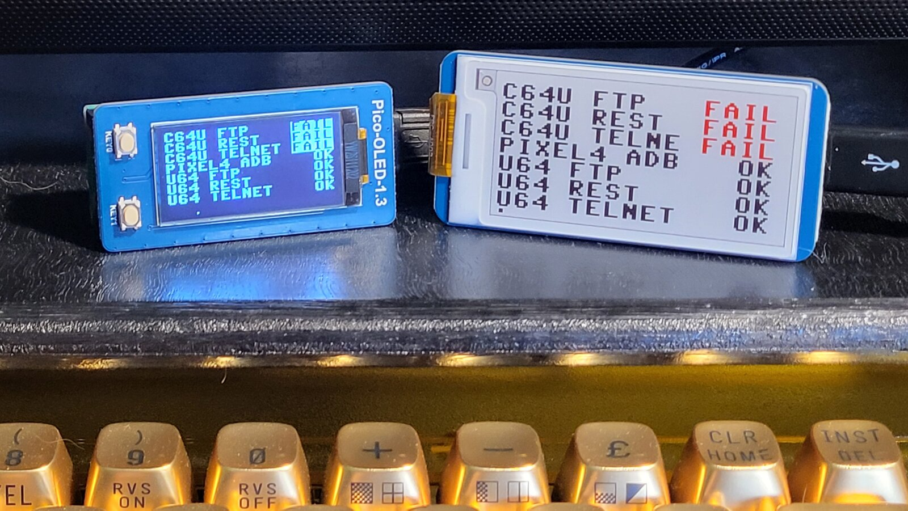
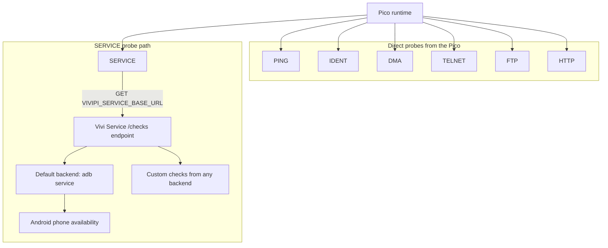
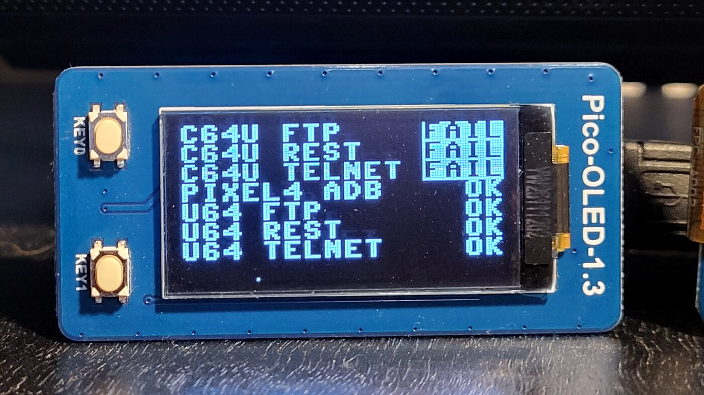

# ViviPi

See your device health at a glance.

[](https://github.com/chrisgleissner/vivipi/actions/workflows/ci.yml)
[](https://codecov.io/gh/chrisgleissner/vivipi)
[](https://www.gnu.org/licenses/gpl-3.0.en.html)
[](https://github.com/chrisgleissner/vivipi/releases)
[](https://github.com/chrisgleissner/vivipi)

ViviPi, pronounced "VEE-vee-pie", is a compact health display for Raspberry Pi Pico modules. It runs checks directly from the Pico, can include additional check results from a remote service, and presents the combined status in a fixed-width UI that is easy to read at a glance.

The project was specifically set up to perform health check monitoring against a Commodore 64 Ultimate or Ultimate 64, but it can also be used to monitor other devices.

<p align="center">
  
</p>

Shown above are the two Pico 2W builds tested on real hardware: `waveshare-pico-oled-1.3` and `waveshare-pico-epaper-2.13-b-v4`.

## Features

- Fixed-width status UI designed for quick visual inspection.
- Built-in `PING`, `IDENT`, `DMA`, `TELNET`, `FTP`, and `HTTP` probes.
- `SERVICE` probes for checks loaded from a host-side `/checks` endpoint.
- Scheduling and back-off to avoid hammering target devices.
- Two-button navigation for overview and detail pages.
- Support for Pico OLED, LCD, and e-paper display families.
- Single `./build` workflow for install, lint, test, firmware build, and deploy.

## Quick start

The following steps take you from a fresh clone to a built and deployed ViviPi device.

Requirements:

- Python 3.12+
- `python3 -m venv`
- `adb`, only if you want to use the default Android-backed service
- `mpremote`, only if you want `./build deploy` to copy files to a Pico 2W

### 1. Create a local build config

`config/build-deploy.yaml` is the main build configuration. For normal local use, create a local override:

```bash
cp config/build-deploy.local.example.yaml config/build-deploy.local.yaml
````

Edit `config/build-deploy.local.yaml` and set:

* `wifi.ssid`
* `wifi.password`
* `service.base_url`, only if you want `SERVICE` checks

`./build render-config`, `./build build-firmware`, and `./build deploy` automatically use `config/build-deploy.local.yaml` when it exists.

You can also provide the same values through environment variables:

```bash
export VIVIPI_WIFI_SSID="your-wifi-name"
export VIVIPI_WIFI_PASSWORD="your-wifi-password"
export VIVIPI_SERVICE_BASE_URL="http://192.168.1.10:8080/checks"
```

| Variable                  | Required | Used by                                     | Notes                                                                                     |
| ------------------------- | -------- | ------------------------------------------- | ----------------------------------------------------------------------------------------- |
| `VIVIPI_WIFI_SSID`        | Yes      | `wifi.ssid`                                 | Required to build the device config                                                       |
| `VIVIPI_WIFI_PASSWORD`    | Yes      | `wifi.password`                             | Required to build the device config                                                       |
| `VIVIPI_SERVICE_BASE_URL` | No       | `service.base_url`, sample `SERVICE` checks | Must be reachable from the Pico over Wi-Fi, for example `http://192.168.1.10:8080/checks` |

If `VIVIPI_SERVICE_BASE_URL` is not set, build-time filtering removes `SERVICE` checks and keeps the default direct checks from [config/checks.yaml](config/checks.yaml). `IDENT` and `DMA` are supported as well, but must be added to your checks config explicitly.

To ignore the local override, pass the checked-in config directly:

```bash
./build --config config/build-deploy.yaml
```

If a local target changes IP address, update `wifi.host_aliases` in `config/build-deploy.local.yaml`. The checked-in `config/checks.local.yaml` targets use those aliases.

### 2. Run the default local workflow

```bash
./build
```

Running `./build` without a command is equivalent to:

```bash
./build ci
```

### 3. Start the default Vivi Service if you want `SERVICE` checks

```bash
./build service --host 0.0.0.0 --port 8080
```

The default host-side service discovers connected ADB devices and exposes them as checks. Its implementation lives in [src/vivipi/services/adb_service.py](src/vivipi/services/adb_service.py).

### 4. Optionally run one host-side probe pass

```bash
scripts/vivipulse --mode local
```

### 5. Build and deploy to the Pico

```bash
./build build-firmware
./build deploy
```

`./build deploy` uses `mpremote connect auto` to copy the prepared filesystem to the first connected Pico. Use `--device-port` to target a specific board.

This command does not flash a MicroPython UF2 onto a blank board. The board must already have a suitable MicroPython firmware installed.

## Tested hardware

This repository currently has real hardware coverage for:

* `waveshare-pico-oled-1.3`
* `waveshare-pico-epaper-2.13-b-v4`

Testing was performed against an Ultimate 64 Elite I, a Commodore 64 Ultimate Founders Edition, and a Pixel 4 connected over ADB to a Kubuntu 24.04 machine running a custom service probe.

Other display configurations are currently untested in this project. For the full display matrix, photos, pin mapping, and display-control details, see [docs/reference.md](docs/reference.md).

## System architecture

ViviPi supports two probe paths:

* Direct probes that run on the Pico itself: `PING`, `IDENT`, `DMA`, `TELNET`, `FTP`, and `HTTP`
* `SERVICE` probes that fetch checks from a host-side endpoint


```mermaid
flowchart TB
  Pico[Pico runtime]

  subgraph Direct[Direct probes from the Pico]
    direction LR
    Ping[PING]
    Ident[IDENT]
    Dma[DMA]
    Telnet[TELNET]
    Ftp[FTP]
    Http[HTTP]
  end

  subgraph ServicePath[SERVICE probe path]
    direction LR
    ServiceProbe[SERVICE]
    ServiceAPI[Vivi Service /checks endpoint]
    AdbBackend[Default backend: adb service]
    Android[Android phone availability]
    CustomChecks[Custom checks from any backend]

    ServiceProbe -->|GET VIVIPI_SERVICE_BASE_URL| ServiceAPI
    ServiceAPI --> AdbBackend
    AdbBackend --> Android
    ServiceAPI --> CustomChecks
  end

  Pico --> Ping
  Pico --> Ident
  Pico --> Dma
  Pico --> Telnet
  Pico --> Ftp
  Pico --> Http
  Pico --> ServiceProbe
```

Direct probes are useful when the Pico can check the target itself. `SERVICE` probes are the extension point for checks that need another machine, while still appearing in the same Pico UI.

## Overview Display

The overview is ViviPi's default screen. On the standard 16x8 layout, it shows one check per row, sorted alphabetically by display name, with the current status right-aligned at the end of the row. If all checks fit on one screen, ViviPi stays on that single overview page. If they do not fit, ViviPi keeps showing overview pages and rotates between them automatically on the display's page interval, which is `20s` by default on the tested OLED family, instead of dropping into per-check detail screens by itself.

This is different from the detail view. Each check has exactly one detail page. That page shows the check name and `STATUS`, then includes `LAT`, `AGE`, and one line of details text when those values are available. Detail pages are interactive, not automatic: they are only reachable on hardware that has buttons wired for navigation.

<p align="center">
  
  <br>
  <em>Tested monochrome OLED build: Waveshare Pico OLED 1.3</em>
</p>

On the tested monochrome OLED build, `Key 1` / button `b` toggles between the overview and the detail page for the currently selected check. `Key 0` / button `a` advances through the checks; in detail mode, that means stepping from one probe's detail page to the next. Displays without buttons still show the overview pages, but they cannot open probe-specific detail pages interactively.

The deployed OLED runtime keeps the overview acting like a clean status board rather than a menu with a persistent cursor. The buttons therefore matter mainly for entering detail mode and moving between probe details, not for turning the overview into a visibly highlighted selector.

Status emphasis depends on the hardware:

* On monochrome OLED displays, failed status text is shown in reverse video.
* On black, white, and red e-paper displays, failed status text is shown in red.

A thin bottom heartbeat indicator advances when a probe completes. Visible movement means the runtime is alive and the probe cycle is still progressing.

### Probe reference

| Probe     | Performs                                          | Success condition                                                                                                                          | Failure condition or note                                                                                                                                                                                                                                         |
| --------- | ------------------------------------------------- | ------------------------------------------------------------------------------------------------------------------------------------------ | ----------------------------------------------------------------------------------------------------------------------------------------------------------------------------------------------------------------------------------------------------------------- |
| `PING`    | ICMP ping                                         | Response received; latency measured locally                                                                                                | No response or timeout                                                                                                                                                                                                                                            |
| `IDENT`   | UDP/64 JSON discovery request                     | Returns a JSON device identity payload with a matching echo token                                                                          | Invalid JSON, missing identity fields, echo mismatch, connection failure, or timeout                                                                                                                                                                              |
| `DMA`     | TCP/64 DMA command session with optional password | Authenticates when configured, identifies the device, reads the debug register, and returns flash metadata                                 | Authentication failure, invalid reply payloads, connection failure, or timeout                                                                                                                                                                                    |
| `TELNET`  | Telnet session with optional credentials          | `OK` after Telnet returns a non-empty response with no clear failure markers and the probe drains that response before closing the session | Connection failure, explicit failure-marker text such as denied/incorrect/failed/invalid, no non-empty response before idle/close, incomplete response consumption before timeout/chunk limit, or immediate close/reset before any non-empty response is received |
| `FTP`     | FTP control session with optional credentials     | A valid FTP greeting is received and the control socket stays usable long enough to quit cleanly                                           | Missing or invalid greeting, connection failure, or timeout                                                                                                                                                                                                       |
| `HTTP`    | HTTP request                                      | Response status is `2xx` or `3xx`; latency measured locally                                                                                | Non-`2xx`/`3xx` response or timeout                                                                                                                                                                                                                               |
| `SERVICE` | HTTP request to a `/checks` endpoint              | Response returns a valid checks payload; each returned check becomes an independent ViviPi check                                           | The default backend uses `adb` to report Android availability, but any backend can return checks through the same schema                                                                                                                                          |

## Default tested target

| Component                | Value                                                                                                      |
| ------------------------ | ---------------------------------------------------------------------------------------------------------- |
| Board                    | Raspberry Pi Pico 2W                                                                                       |
| Display                  | 128x64 monochrome OLED                                                                                     |
| Display controller       | SH1107                                                                                                     |
| Character grid           | 16 columns x 8 rows using 8x8 bitmap cells                                                                 |
| Display interface        | 4-wire SPI, mode 3                                                                                         |
| Native transport mapping | Portrait-native 64x128 SH1107 page stream with inferred column offset `32` for the Waveshare Pico OLED 1.3 |
| Tested button mapping    | `a: GP15`, `b: GP17`                                                                                       |

This is the button-equipped build used for the interactive detail flow described above.

For the full pin map, button behavior, and screen flow, see [docs/reference.md](docs/reference.md#default-hardware-target-and-controls).

## More detail

Use [docs/reference.md](docs/reference.md) for:

* editor workflows for Thonny and VS Code
* release-asset installs
* the full build command and artifact reference
* Kubuntu ADB auto-start setup
* full `vivipulse` usage
* the detailed `build-deploy.yaml` schema
* the supported display matrix
* checks field reference
* testing, release, and repository layout notes

For the product contract and requirement coverage, see [docs/spec.md](docs/spec.md) and [docs/spec-traceability.md](docs/spec-traceability.md).
