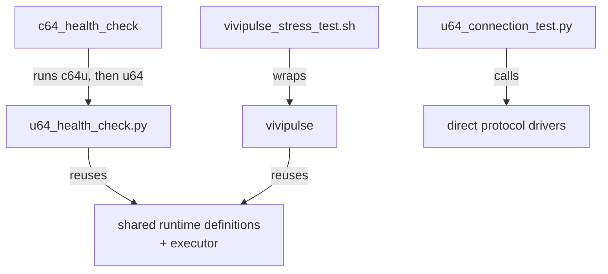

# C64U / U64 CLI tools

Use these host-side commands when you want to perform dedicated smoke, soak or stress tests. 

## Start here

If you just want the right command, start with this table:

| Goal | Command | Best when |
| --- | --- | --- |
| Quick check, both targets | `./scripts/c64_health_check` | You want the fastest answer |
| Quick check, one target | `./scripts/u64_health_check.py u64` | You only care about `u64` or `c64u` |
| Longer ViviPi-style run with artifacts | `./scripts/vivipulse_stress_test.sh` | You want a shared-config soak |
| Direct per-host control | `./scripts/u64_connection_test.py --profile soak -H u64` | You want exact control over probes and behavior |

## How the tools fit together

Under the hood:

- `c64_health_check` is a thin wrapper that runs `u64_health_check.py` twice: once for `c64u`, once for `u64`.
- `u64_health_check.py` and `vivipulse` both reuse ViviPi's shared runtime definition and executor path.
- `vivipulse_stress_test.sh` is a thin wrapper around `vivipulse --mode soak`.
- `u64_connection_test.py` is the separate direct path. It talks to protocol drivers directly instead of going through the shared ViviPi scheduler.



## Quick health checks

Use `./scripts/c64_health_check` for the fastest "what is the state right now?" check. It runs the concise ViviPi-compatible probe set for both configured targets and prints one line per probe, such as `PING`, `REST`, `IDENT`, `DMA`, `FTP`, and `TELNET`.

```bash
./scripts/c64_health_check
./scripts/u64_health_check.py u64
./scripts/u64_health_check.py c64u --build-config config/build-deploy.local.yaml
./scripts/u64_health_check.py u64 --checks-config config/checks.local.yaml
```

These commands resolve targets from the active build and checks configs. Keep real device addresses current in `config/build-deploy.local.yaml`.

## Longer runs with `vivipulse`

Start with `./scripts/vivipulse_stress_test.sh` when you want a longer run that stays aligned with ViviPi's shared config and artifact model. The wrapper runs `vivipulse` in `soak` mode with parity enabled, writes JSON artifacts under `artifacts/vivipulse/`, and exits non-zero on transport failures, unexpected exceptions, blocked hosts, or parity mismatches.

```bash
./scripts/vivipulse_stress_test.sh
DURATION=2h ./scripts/vivipulse_stress_test.sh
ARTIFACTS_DIR=artifacts/vivipulse/c64u-u64 ./scripts/vivipulse_stress_test.sh
BUILD_CONFIG=config/build-deploy.local.yaml ./scripts/vivipulse_stress_test.sh
```

Use `./scripts/vivipulse` directly when you want more control:

```bash
./scripts/vivipulse --mode plan
./scripts/vivipulse --mode local
./scripts/vivipulse --mode reproduce --passes 2
./scripts/vivipulse --mode search --passes 2 --ultimate-repo ../1541ultimate
./scripts/vivipulse --mode soak --duration 2h --same-host-backoff-ms 1000
./scripts/vivipulse --mode soak --duration 30m --stop-on-failure --json
```

Useful `vivipulse` flags:

- **Mode:** `--mode plan`, `--mode local`, `--mode reproduce`, `--mode search`, `--mode soak`
- **Run length and pacing:** `--duration 30m`, `--passes 2`, `--same-host-backoff-ms 1000`, `--allow-concurrent-same-host`
- **Artifacts and logging:** `--artifacts-dir ...`, `--json`, `--debug`, `--parity-mode`
- **Failure handling:** `--stop-on-failure`, `--interactive-recovery --resume-after-recovery`
- **Config inputs:** `--build-config ...`, `--checks-config ...`, `--runtime-config ...`

For the full `vivipulse` flag reference, see [reference.md](reference.md#vivipulse).

## Direct per-host control with `u64_connection_test.py`

Use `./scripts/u64_connection_test.py` when you want to talk to one host directly and control the probe mix, concurrency, protocol depth, stream checks, and intentionally degraded behavior.

Always spell out the host so it is obvious whether you are targeting `u64` or `c64u`:

```bash
./scripts/u64_connection_test.py --profile soak -H u64
./scripts/u64_connection_test.py --profile stress -H u64
./scripts/u64_connection_test.py --profile soak -H c64u --duration-s 300
```

Profile defaults:

| Profile | Default shape | Default duration | Best for |
| --- | --- | --- | --- |
| `soak` | Concurrent read/write-capable probe loop with audio and video stream monitoring | `12h` | Stability validation |
| `stress` | Concurrent multi-runner direct loop with more hostile FTP/Telnet behavior | `120s` | Reproducing listener or session-lifecycle failures |

Useful flags:

- **Probe set:** `--probes ping,ident,dma,telnet,ftp,http[,modem]`
- **Concurrency:** `--schedule sequential|concurrent`, `--runners 4`
- **Protocol depth:** `--surface smoke|read|readwrite`, `--http-surface read`, `--ftp-surface readwrite`
- **Intentional degradation:** `--mode open|incomplete|invalid`, `--ftp-mode invalid`, `--telnet-mode incomplete`
- **Streams:** `--stream`, `--stream audio`, `--stream video`
- **Auth and endpoints:** `-H u64`, `--network-password ...`, `--http-port ...`, `--ftp-port ...`, `--telnet-port ...`

Quick recipes:

```bash
./scripts/u64_connection_test.py --profile stress -H u64 --runners 4
./scripts/u64_connection_test.py --profile soak -H c64u --probes ping,ident,dma,telnet,ftp,http --stream audio
./scripts/u64_connection_test.py --profile soak -H u64 --surface read --http-surface readwrite
./scripts/u64_connection_test.py --schedule concurrent --runners 2 --ftp-mode invalid --telnet-mode incomplete -H u64
```

If you set `--probes` without `--stream`, the profile-default stream checks are disabled. Add `--stream` explicitly when you want stream verification.

## Which one should you use?

- Use `c64_health_check` or `u64_health_check.py` when you want a fast answer.
- Use `vivipulse` when you want ViviPi's shared config, scheduling rules, and artifacts.
- Use `u64_connection_test.py` when you want the most direct control over one host.

## Full help: `u64_connection_test.py`

This is the widest direct control surface on this page. The full current `--help` output is included here so you can scan every option without leaving the document.

```text
usage: u64_connection_test.py [-h] [-H HOST] [-d DELAY_MS] [-n LOG_EVERY] [-u FTP_USER] [-P FTP_PASS]
                              [--network-password NETWORK_PASSWORD] [--http-path HTTP_PATH] [--http-port HTTP_PORT]
                              [--ftp-port FTP_PORT] [--telnet-port TELNET_PORT] [--modem-port MODEM_PORT] [-v]
                              [--profile {soak,stress}] [--probes PROBES] [--schedule {sequential,concurrent}]
                              [--runners RUNNERS] [--duration-s DURATION_S] [--surface {smoke,read,readwrite}]
                              [--mode {complete,open,incomplete,invalid}] [--http-surface {smoke,read,readwrite}]
                              [--ftp-surface {smoke,read,readwrite}] [--telnet-surface {smoke,read,readwrite}]
                              [--dma-surface {smoke,read,readwrite}] [--ping-mode {complete,open,incomplete,invalid}]
                              [--http-mode {complete,open,incomplete,invalid}]
                              [--ftp-mode {complete,open,incomplete,invalid}]
                              [--telnet-mode {complete,open,incomplete,invalid}] [--stream [{audio,video} ...]]

Repeated U64 connectivity checks. Default: 12h soak with concurrent readwrite probes and audio+video streams. ident targets UDP port 64 JSON discovery; dma targets the DMA-capable TCP port 64 command endpoint.

options:
  -h, --help            show this help message and exit
  -H HOST, --host HOST  Target host or IP
  -d DELAY_MS, --delay-ms DELAY_MS
                        Delay between checks in milliseconds
  -n LOG_EVERY, --log-every LOG_EVERY
                        Log every Nth successful iteration
  -u FTP_USER, --ftp-user FTP_USER
                        FTP username
  -P FTP_PASS, --ftp-pass FTP_PASS
                        Legacy alias for the shared device network password.
  --network-password NETWORK_PASSWORD
                        Shared device network password used for HTTP, Telnet, FTP, and dma.
  --http-path HTTP_PATH
                        HTTP path
  --http-port HTTP_PORT
                        HTTP port
  --ftp-port FTP_PORT   FTP port
  --telnet-port TELNET_PORT
                        Telnet port
  --modem-port MODEM_PORT
                        Optional modem listener port
  -v, --verbose         Log every successful check
  --profile {soak,stress}
                        Preset profile. Explicit --probes, --schedule, --runners, --surface, --mode, --*-surface, and
                        --*-mode flags override the profile.
  --probes PROBES       Ordered non-empty comma-separated probe list using ping,ident,dma,telnet,ftp,http,modem; ident
                        is UDP/64 and dma is TCP/64. When set without --stream, profile-default streams are disabled.
  --schedule {sequential,concurrent}
                        Per-runner scheduling mode.
  --runners RUNNERS     Logical runner count >= 1.
  --duration-s DURATION_S
                        Optional total run duration in seconds. Soak defaults to 43200 (12h); stress defaults to 120.
  --surface {smoke,read,readwrite}
                        Apply the same surface to all probes, falling back per protocol to the nearest supported lower
                        surface.
  --mode {complete,open,incomplete,invalid}
                        Apply the same correctness mode to all probes, falling back per protocol to the nearest
                        supported lower mode. Correctness degradation: complete (finish and close cleanly), open
                        (finish and skip orderly teardown), incomplete (abort before completion), invalid (send
                        malformed or unsupported input).
  --http-surface {smoke,read,readwrite}
                        HTTP probe surface.
  --ftp-surface {smoke,read,readwrite}
                        FTP probe surface.
  --telnet-surface {smoke,read,readwrite}
                        Telnet probe surface.
  --dma-surface {smoke,read,readwrite}
                        DMA TCP/64 probe surface.
  --ping-mode {complete,open,incomplete,invalid}
                        Ping probe correctness.
  --http-mode {complete,open,incomplete,invalid}
                        HTTP probe correctness.
  --ftp-mode {complete,open,incomplete,invalid}
                        FTP probe correctness.
  --telnet-mode {complete,open,incomplete,invalid}
                        Telnet probe correctness.
  --stream [{audio,video} ...]
                        Verify audio, video, or both UDP streams. Omit values to select both audio and video.

Profile precedence: if --profile is supplied, explicit --probes, --schedule, --runners, --surface, --mode, --*-surface, and --*-mode values override the profile.

Correctness degradation: complete (finish and close cleanly), open (finish and skip orderly teardown), incomplete (abort before completion), invalid (send malformed or unsupported input).

Examples:
  ./u64_connection_test.py
  ./u64_connection_test.py --profile soak
  ./u64_connection_test.py --profile stress
  ./u64_connection_test.py --profile soak --duration-s 300
  ./u64_connection_test.py --surface readwrite
  ./u64_connection_test.py --mode open
  ./u64_connection_test.py --mode incomplete
  ./u64_connection_test.py --probes ping,ident,dma,telnet,ftp,http
  ./u64_connection_test.py --schedule concurrent --runners 3
  ./u64_connection_test.py --http-surface read
  ./u64_connection_test.py --ftp-surface readwrite --telnet-surface read
  ./u64_connection_test.py --telnet-mode incomplete
  ./u64_connection_test.py --schedule concurrent --runners 2 --ftp-mode invalid --telnet-mode incomplete
  ./u64_connection_test.py --profile stress --runners 4
  ./u64_connection_test.py --profile soak --probes ping,http
```
