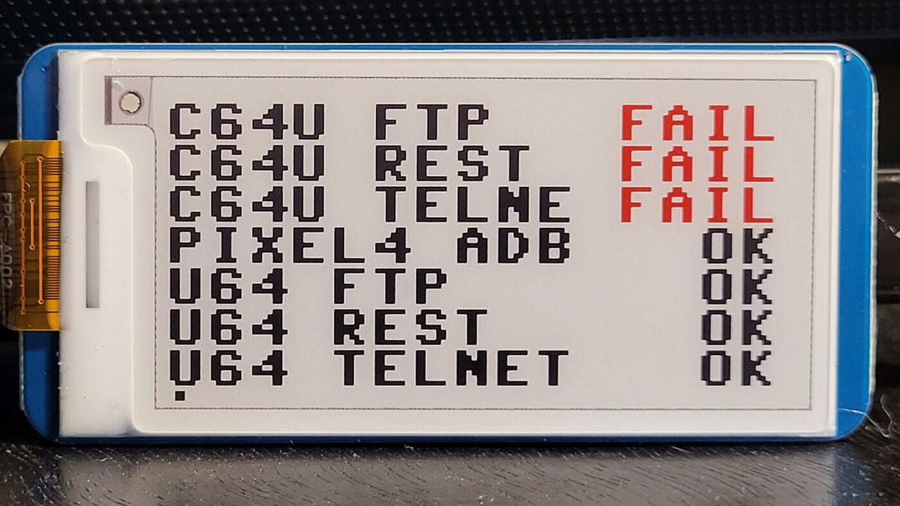

# ViviPi Reference

This page contains the detailed operational material that used to live in the README. The README now stays focused on the main features, system architecture, configuration, and deployment path.

For the product contract, see [spec.md](spec.md). For requirement coverage, see [spec-traceability.md](spec-traceability.md).

## Default hardware target and controls

### Default hardware target

- Board: Raspberry Pi Pico 2W
- Display: 128x64 monochrome OLED
- Display controller: SH1107
- Character grid: 16 columns x 8 rows using 8x8 bitmap cells
- Display interface: 4-wire SPI, mode 3
- Native transport mapping: portrait-native 64x128 SH1107 page stream with inferred column offset 32 for the Waveshare Pico OLED 1.3

### Pin mapping

| Signal | GPIO |
| --- | --- |
| DIN | GP11 |
| CLK | GP10 |
| CS | GP9 |
| DC | GP8 |
| RST | GP12 |
| BTN A / Key 0 | GP15 |
| BTN B / Key 1 | GP17 |

On the main tested Waveshare Pico OLED 1.3 hardware, `GP15` is User Key 0 and `GP17` is User Key 1. In the config and code these are named `a` and `b`. By default, `a: GP15` and `b: GP17` use pull-up inputs, so a press pulls the line away from its idle state. If your wiring needs it, each button can be configured explicitly as `{ pin: GP15, pull: up }` or `{ pin: GP15, pull: down }`.

### On-device controls

ViviPi is meant to be usable directly from the Pico display module without any extra menu system.

#### Main tested screen

The tested Waveshare Pico OLED 1.3 is the interactive build in this repository. It has two hardware buttons, so it can open per-probe detail pages. Displays without buttons still show ViviPi's overview pages, but they cannot enter those detail pages interactively.

On the main tested screen, the controls work like this:

| Physical key | GPIO | Internal button name | What it does |
| --- | --- | --- | --- |
| `Key 1` | `GP17` | `b` / `Button.B` | Enter the detail page for the current check. Press it again to leave details and return to the overview. |
| `Key 0` | `GP15` | `a` / `Button.A` | Advance to the next check. In detail mode, this moves to the next probe's detail page. |

Additional input behavior:

- Presses are debounced with a 20-50 ms window; the default controller uses `30 ms`.
- Holding `Key 0` repeats every `500 ms`, which lets you move through detail pages quickly.
- `Key 1` is single-step only and does not auto-repeat when held.
- In code and build config, `Key 0` maps to `a` and `Button.A`, while `Key 1` maps to `b` and `Button.B`.
- The deployed OLED runtime does not draw a persistent selection cursor on the overview; `Key 0` still advances the currently selected check behind the scenes.

#### Screen flow

1. Start on the overview page.
2. If there are more checks than fit on one screen, ViviPi rotates between overview pages automatically.
3. Press `Key 1` to open the detail page for the currently selected check.
4. Press `Key 0` to step through the remaining per-check detail pages.
5. Press `Key 1` again to leave details and return to the overview.

## Hardware notes

### Tested hardware

Current physical test coverage in this repository is limited to these two Pico 2W display builds:

- `waveshare-pico-oled-1.3`
- `waveshare-pico-epaper-2.13-b-v4`

All testing was performed against an Ultimate 64 Elite I, a Commodore 64 Ultimate Founders Edition, and a Pixel 4 connected via ADB to a Kubuntu 24.04 machine running a custom service probe.

<p align="center">
  
</p>

<table>
  <tr>
    <td align="center">
      
      <br>
      <em>Tested OLED build: Waveshare Pico OLED 1.3</em>
    </td>
    <td align="center">
      
      <br>
      <em>Tested e-paper build: Waveshare Pico ePaper 2.13-B V4</em>
    </td>
  </tr>
</table>

All other display configurations listed here are currently untested on physical hardware in this project. There are no planned validation runs for additional devices at the moment; contributions that add verified hardware coverage are welcome.

## Editor workflows

### Thonny

1. Create `config/build-deploy.local.yaml` from `config/build-deploy.local.example.yaml` or export the `VIVIPI_WIFI_*` environment variables.
2. Run `./build build-firmware`.
3. In Thonny, connect to `MicroPython (Raspberry Pi Pico)`.
4. Open `artifacts/release/vivipi-device-fs/` for single-device configs, or `artifacts/release/devices/<device-id>/vivipi-device-fs/` for multi-device configs, as the local source tree and upload its contents to the device root.
5. Re-run `./build build-firmware` whenever config or source changes, then re-upload the updated files.

The generated `vivipi-device-fs/` directory is the exact device filesystem layout expected by each Pico.

### VS Code

The official Raspberry Pi Pico extension handles Pico toolchain setup, and its MicroPython workflow relies on the MicroPico extension. This repository includes workspace recommendations for both extensions plus ready-made tasks in `.vscode/tasks.json`.

1. Open the repository as a single-folder workspace.
2. Install the recommended extensions when prompted.
3. Create `config/build-deploy.local.yaml` from `config/build-deploy.local.example.yaml` for local Wi-Fi and optional service settings.
4. Run the `ViviPi: Build Firmware Bundle` task to regenerate the device filesystem tree or per-device trees.
5. Run the `ViviPi: Deploy To First Connected Pico` task for single-device configs, or use `./build deploy` for a multi-device local config.

If you have more than one configured board attached, `./build deploy` targets all configured devices by stable selector. Use `./build deploy --device <id>` to target one board.

## Install paths

### Develop from source

Use the source checkout when you want the full local workflow:

```bash
./build install
./build test
./build build-firmware
./build service --host 0.0.0.0 --port 8080
```

The canonical entrypoint is `./build`. Run `./build help` for the full CLI surface.

### Install from GitHub releases

Each GitHub release publishes a small, versioned set of assets. Download the files that match the tag you want to install.

| Asset | Purpose | Contains only what is needed for | How to use it |
| --- | --- | --- | --- |
| `vivipi-device-filesystem-<version>.zip` | Device update bundle | Copying ViviPi onto a Pico after the base MicroPython UF2 is already installed | Unzip or copy the contents onto the Pico with `mpremote fs cp` |
| `pico2w-micropython-<version>.txt` | Pinned board bootstrap reference | Finding the exact MicroPython download page and default board port used for the release | Read it first when preparing a blank Pico |
| `vivipi-service-bundle-<version>.zip` | Local service starter kit | Running the default ADB-backed service or a minimal custom `SERVICE` endpoint | Unzip it, install the bundled wheel, then run either `vivipi-adb-service` or `custom-service-example.py` |
| `vivipi-source-<version>.zip` | Tagged source snapshot | Inspecting or rebuilding the exact source used for the release | Download if you want a ZIP source archive with the release tag in the filename |
| `vivipi-source-<version>.tar.gz` | Tagged source snapshot | Inspecting or rebuilding the exact source used for the release | Download if you want a tarball source archive with the release tag in the filename |

#### Device install from a release

1. Download `pico2w-micropython-<version>.txt` and `vivipi-device-filesystem-<version>.zip` from the release page.
2. Use the URL in `pico2w-micropython-<version>.txt` to install the base MicroPython UF2 on the Pico if the board is blank.
3. Copy the contents of `vivipi-device-filesystem-<version>.zip` onto the Pico with `mpremote fs cp`, or unzip it locally and use `./build deploy` against the unpacked `vivipi-device-fs/` tree.
4. Point `VIVIPI_SERVICE_BASE_URL` at a reachable host only if you want `SERVICE` checks baked into `config.json`.

#### Service install from a release

1. Download and unzip `vivipi-service-bundle-<version>.zip`.
2. Install the bundled wheel with `python -m pip install vivipi-*.whl`.
3. Start the default service with `vivipi-adb-service --host 0.0.0.0 --port 8080` if you want ADB-backed checks.
4. Or start `custom-service-example.py --host 0.0.0.0 --port 8080` and adapt its `/checks` payload to expose your own checks.
5. Set `VIVIPI_SERVICE_BASE_URL` in your build configuration to `http://<host>:8080/checks` before building the device filesystem.

## Build, test, and package

`./build` is the canonical entrypoint. Running it with no command is equivalent to `./build ci`, and `./build all` is an alias for the same workflow.

### Common commands

| Command | What it does |
| --- | --- |
| `./build` | Install dependencies, run Ruff, run pytest, and build firmware assets |
| `./build install` | Create the local virtual environment and install dev dependencies |
| `./build lint` | Run Ruff |
| `./build test` | Run pytest |
| `./build coverage` | Run pytest with branch coverage output |
| `./build ci` | Run the full local CI workflow |
| `./build list-devices` | Show each configured device selector and whether it is serial-ready, in BOOTSEL, missing, or ambiguous |
| `./build render-config` | Render `artifacts/device/config.json` from the build config |
| `./build build-firmware` | Build the firmware bundle into `artifacts/release` |
| `./build provision` | Provision configured BOOTSEL devices with the configured base UF2 |
| `./build release-assets` | Build the versioned GitHub release assets |
| `./build deploy` | Build the firmware bundle and copy it to the configured Pico target or targets via `mpremote` |
| `./build service --host 0.0.0.0 --port 8080` | Run the default ADB-backed Vivi Service |
| `scripts/vivipulse --mode local` | Run one local pass of all configured health checks |
| `scripts/vivipulse --mode plan` | Resolve the host-side probe plan without sending traffic |

Typical examples:

```bash
VIVIPI_WIFI_SSID="your-wifi" \
VIVIPI_WIFI_PASSWORD="your-password" \
./build build-firmware
```

```bash
VIVIPI_WIFI_SSID="your-wifi" \
VIVIPI_WIFI_PASSWORD="your-password" \
VIVIPI_SERVICE_BASE_URL="http://192.168.1.10:8080/checks" \
./build build-firmware
```

```bash
./build service --host 0.0.0.0 --port 8080
```

Generated artifacts are written under `artifacts/`.

### Key outputs

| Output | Produced by | Purpose |
| --- | --- | --- |
| `artifacts/device/config.json` or `artifacts/device/devices/<device-id>/config.json` | `./build render-config` | Rendered runtime config |
| `artifacts/release/vivipi-device-fs/` or `artifacts/release/devices/<device-id>/vivipi-device-fs/` | `./build build-firmware` | Unpacked device filesystem tree |
| `artifacts/release/vivipi-device-filesystem-<version>.zip` | `./build build-firmware` and `./build release-assets` | Deployable device bundle |
| `artifacts/release/pico2w-micropython-<version>.txt` | `./build build-firmware` and `./build release-assets` | Pinned MicroPython download reference |
| `artifacts/release/vivipi-service-bundle-<version>.zip` | `./build release-assets` | Service starter bundle |
| `artifacts/release/vivipi-source-<version>.zip` and `artifacts/release/vivipi-source-<version>.tar.gz` | `./build release-assets` | Tagged source archives |

## Default Vivi Service

The default host-side service discovers connected ADB devices and exposes them as monitoring checks.

```bash
./build service --host 0.0.0.0 --port 8080
```

The HTTP endpoint implementation lives in [../src/vivipi/services/adb_service.py](../src/vivipi/services/adb_service.py). The sample `SERVICE` check in [../config/checks.yaml](../config/checks.yaml) points at `VIVIPI_SERVICE_BASE_URL`.

### Kubuntu ADB auto-start

The checked-in local development config in [../config/checks.local.yaml](../config/checks.local.yaml) probes the Pixel 4 through `http://mickey:8081/vivipi/probe/adb/9B081FFAZ001WX`, so this machine needs the ADB-backed service listening on port `8081`.

Install the user-level systemd units once:

```bash
./scripts/install_adb_service_user_units.sh
```

That installer:

- enables `vivipi-adb-service.service` so the HTTP service starts automatically for your user session
- enables `vivipi-adb-recover.timer` so `adb start-server` and `adb reconnect offline` run periodically after boot and resume
- starts the service immediately on the current login session

Manual fallback commands:

```bash
./scripts/run_adb_service.sh start
./scripts/run_adb_service.sh ensure-adb
```

## Vivipulse

`scripts/vivipulse` is the host-side stability, reproduction, mitigation-search, and soak-testing entrypoint for direct ViviPi probes.

It intentionally reuses the Pico's shared lower-level execution seam:

- `vivipi.runtime.checks.build_runtime_definitions()`
- `vivipi.runtime.checks.build_executor()`
- `vivipi.core.execution.execute_check()`
- `vivipi.core.scheduler.due_checks()`
- `vivipi.core.scheduler.probe_host_key()`
- `vivipi.core.scheduler.probe_backoff_remaining_s()`

It intentionally does not run the Pico shell on Linux. `vivipulse` does not reuse `firmware.runtime.run_forever()` as its host loop, `RuntimeApp`, display rendering, button handling, Wi-Fi bootstrap, or firmware display backends.

### Purpose

Use `vivipulse` when you want to:

- reproduce instability outside the Pico UI/runtime shell
- capture request-level JSONL traces with exact ordering and timing
- identify the last-success and first-failure boundary for a target
- inspect a local `1541ultimate` checkout to guide safer probe profiles
- search for a less disruptive same-host execution profile
- soak-test a chosen profile for a fixed wall-clock duration

### Inputs

The canonical repository input is `--build-config`, which defaults to `config/build-deploy.yaml` and prefers `config/build-deploy.local.yaml` automatically when no explicit input option is supplied.

Supported input shapes:

- `--build-config PATH`
- `--runtime-config PATH`
- `--checks-config PATH`

### Modes

`local` runs exactly one host-side pass of all resolved checks and is the simplest way to verify the full local health configuration:

```bash
scripts/vivipulse --mode local
```

`plan` resolves checks, same-host groups, and ordering without sending traffic:

```bash
scripts/vivipulse --mode plan
```

`reproduce` runs the shared probes from Linux and writes request-level traces:

```bash
scripts/vivipulse --mode reproduce --passes 2 --target http://192.168.1.10/health
```

`search` inspects the local Ultimate firmware source, then evaluates a small mitigation set in priority order:

```bash
scripts/vivipulse \
  --mode search \
  --passes 2 \
  --ultimate-repo ../1541ultimate
```

`soak` runs a chosen profile for a wall-clock duration:

```bash
scripts/vivipulse --mode soak --duration 2h --same-host-backoff-ms 1000
```

Useful controls:

- `--check-id ID` to restrict execution to one or more checks
- `--target TARGET` to restrict execution to an exact target value
- `--same-host-backoff-ms N` to override the configured same-host gap
- `--allow-concurrent-same-host` to disable same-host serialization
- `--interactive-recovery --resume-after-recovery` to stop on transport failure, preserve artifacts, and resume only after explicit confirmation
- `--stop-on-failure` to stop after the first transport failure boundary

### Artifacts

Each run writes a timestamped directory under `artifacts/vivipulse/` containing:

- `trace.jsonl`
- `run-summary.txt`
- `failure-boundary.txt`
- `reuse-map.txt`
- `firmware-research.txt`
- `search-summary.txt`
- `soak-summary.txt`

### Recovery flow

When `--interactive-recovery` is enabled and a target becomes transport-unresponsive, `vivipulse`:

- stops further same-host traffic immediately
- flushes the trace before prompting
- prints last-success and first-failure context
- asks for only the minimum recovery action implied by the failure class
- resumes only when `--resume-after-recovery` is also set and the operator types `resume`

### Prerequisites

- Python 3.12+
- a local ViviPi checkout
- the `1541ultimate` source tree when you want firmware-guided `search` mode

### Intentionally unsupported

- running the full Pico firmware shell on Linux
- host-side display parity testing
- button or Wi-Fi bootstrap behavior
- automatic physical recovery without operator confirmation

## Configuration reference

[../config/build-deploy.yaml](../config/build-deploy.yaml) is the build-time source of truth for:

- device metadata and default board wiring
- display selection and layout behavior
- Wi-Fi credentials
- service endpoint defaults
- the path to the checks config

Environment variables are injected into `build-deploy.yaml` placeholders:

```yaml
wifi:
  ssid: ${VIVIPI_WIFI_SSID}
  password: ${VIVIPI_WIFI_PASSWORD}
```

### Environment variables

| Variable | Required | Used by | Notes |
| --- | --- | --- | --- |
| `VIVIPI_WIFI_SSID` | Yes | `wifi.ssid` | Required to build device config |
| `VIVIPI_WIFI_PASSWORD` | Yes | `wifi.password` | Required to build device config |
| `VIVIPI_SERVICE_BASE_URL` | No | `service.base_url`, sample `SERVICE` checks | Must be reachable from the Pico over Wi-Fi, for example `http://192.168.1.10:8080/checks` |

If `VIVIPI_SERVICE_BASE_URL` is omitted, build-time filtering drops `SERVICE` checks and keeps the direct checks defined in [../config/checks.yaml](../config/checks.yaml).

### build-deploy.yaml reference

| Key | Values | Default | Notes |
| --- | --- | --- | --- |
| `project.name` | string | `vivipi` | Project name stored in the rendered runtime config |
| `device.board` | string | `pico2w` | Board identifier used for packaging and install metadata |
| `device.micropython_port` | `auto` or path-like string | `auto` | Legacy single-device selector for `./build deploy`; multi-device configs should use `devices.<id>.selector` |
| `device.micropython.version` | string | `1.25.0` | Pinned MicroPython version reference |
| `device.micropython.download_page` | absolute URL | Pico 2W download page | Included in the install manifest |
| `device.buttons.a` | GPIO pin name | `GP15` | Left button pin |
| `device.buttons.b` | GPIO pin name | `GP17` | Right button pin |
| `device.display.type` | see display matrix below | `waveshare-pico-oled-1.3` | Selects the backend and infers controller, SPI mode, geometry, default pins, and default page interval |
| `device.display.mode` | `standard`, `compact` | `standard` | Overview layout mode |
| `device.display.columns` | integer `1` to `4` | `1` | Number of overview columns; values above `1` require `device.display.mode: compact` |
| `device.display.column_separator` | exactly one character | space | Inserted only between overview columns |
| `device.display.font` | `extrasmall`, `small`, `medium`, `large`, `extralarge` | `medium` | Resolves the character cell size from the selected display geometry |
| `device.display.font.width_px` | integer `6` to `32` | inferred | Optional backward-compatible override |
| `device.display.font.height_px` | integer `6` to `32` | inferred | Optional backward-compatible override |
| `device.display.page_interval` | integer seconds or `Ns` | inferred by display | Use `0s` to disable automatic page cycling |
| `device.display.column_offset` | non-negative integer | inferred by display | Advanced override for controller-native visible window alignment; the Waveshare Pico OLED 1.3 infers `32` |
| `device.display.failure_color` | color name string | `red` | Used for failed-check accent rendering on color-capable displays |
| `device.display.brightness` | `low`, `medium`, `high`, `max`, or `0` to `255` | `medium` on OLED/LCD | Unsupported on e-paper display types |
| `wifi.ssid` | placeholder or string | none | Normally `${VIVIPI_WIFI_SSID}` |
| `wifi.password` | placeholder or string | none | Normally `${VIVIPI_WIFI_PASSWORD}` |
| `service.base_url` | absolute `http` or `https` URL | omitted | Required only when using `SERVICE` checks |
| `service.default_prefix` | string | `adb` | Default prefix for service-discovered checks |
| `checks_config` | relative path | `checks.yaml` | Path to the checks definition file |
| `devices.<id>.selector.serial_by_id` | path or glob | none | Stable serial selector for one named Pico |
| `devices.<id>.selector.bootsel_disk` | path or glob | none | Optional BOOTSEL disk selector for provisioning a named Pico |
| `devices.<id>.bootstrap.uf2_path` | path | none | Local base MicroPython UF2 used by `./build provision` |
| `devices.<id>.bootstrap.uf2_url` | URL | none | Downloadable base MicroPython UF2 used by `./build provision` |

Visible rows and columns are derived automatically from the selected display geometry and the resolved font size. When configured checks exceed the visible rows, the overview cycles across pages using `device.display.page_interval`.

When `devices` is present, the top-level settings become shared defaults for every named device. Each `devices.<id>` entry can override nested settings such as `device.display.type`, `checks_config`, or provisioning metadata. Fleet-capable commands default to all configured devices, while `--device <id>` limits the operation to one board.

`device.display.page_interval` defaults by display family:

| Display family | Default page interval |
| --- | --- |
| OLED and LCD | `20s` |
| 2.13 inch e-paper | `180s` |
| 2.7 to 2.9 inch e-paper | `240s` |
| 3.7 to 4.2 inch e-paper | `300s` |
| 7.5 inch e-paper | `600s` |

Example:

```yaml
device:
  display:
    type: waveshare-pico-lcd-1.3
    mode: compact
    columns: 2
    font: medium
    page_interval: 20s
```

### Supported display types

Published specs below are based on current The Pi Hut Waveshare product listings. The Waveshare column links directly to the corresponding developer wiki/manual page used for specs and code samples. Some retailer listings use portrait or raw-panel orientation, and some group multiple Waveshare hardware revisions under one product listing.

Please note that only two of these devices are tested; see [Hardware notes](#hardware-notes). Contributions and fixes are welcome.

| `device.display.type` | The Pi Hut | Waveshare | Published display spec | Notes |
| --- | --- | --- | --- | --- |
| `waveshare-pico-oled-1.3` | [Listing](https://thepihut.com/products/1-3-oled-display-module-for-raspberry-pi-pico-64x128) | [Developer page](https://www.waveshare.com/wiki/Pico-OLED-1.3) | `1.3"`, `64x128`, OLED, `SH1107`, SPI/I2C | The Pi Hut publishes this module as `64x128`; ViviPi renders it as `128x64` landscape and uses the validated SH1107 native column offset `32` |
| `waveshare-pico-oled-2.23` | [Listing](https://thepihut.com/products/2-23-oled-display-module-for-raspberry-pi-pico) | [Developer page](https://www.waveshare.com/wiki/Pico-OLED-2.23) | `2.23"`, `128x32`, OLED, `SSD1305`, SPI/I2C | Matches the current Pi Hut listing |
| `waveshare-pico-lcd-0.96` | [Listing](https://thepihut.com/products/0-96-lcd-display-module-for-raspberry-pi-pico-160x80) | [Developer page](https://www.waveshare.com/wiki/Pico-LCD-0.96) | `0.96"`, `160x80`, LCD | Matches the current Pi Hut listing |
| `waveshare-pico-lcd-1.14` | [Listing](https://thepihut.com/products/1-14-ips-lcd-display-module-240x135) | [Developer page](https://www.waveshare.com/wiki/Pico-LCD-1.14) | `1.14"`, `240x135`, IPS LCD | Pi Hut does not split separate Pico `1.14` and `1.14-v2` retail listings; Waveshare uses a shared `Pico-LCD-1.14` page |
| `waveshare-pico-lcd-1.14-v2` | [Listing](https://thepihut.com/products/1-14-ips-lcd-display-module-240x135) | [Developer page](https://www.waveshare.com/wiki/Pico-LCD-1.14) | `1.14"`, `240x135`, IPS LCD | Pi Hut does not split separate Pico `1.14` and `1.14-v2` retail listings; Waveshare uses a shared `Pico-LCD-1.14` page |
| `waveshare-pico-lcd-1.3` | [Listing](https://thepihut.com/products/1-3-ips-lcd-display-module-for-raspberry-pi-pico-240x240) | [Developer page](https://www.waveshare.com/wiki/Pico-LCD-1.3) | `1.3"`, `240x240`, IPS LCD | Matches the current Pi Hut listing |
| `waveshare-pico-lcd-1.44` | [Listing](https://thepihut.com/products/1-44-lcd-display-module-for-raspberry-pi-pico-65k-colors-128x128) | [Developer page](https://www.waveshare.com/wiki/Pico-LCD-1.44) | `1.44"`, `128x128`, LCD | Matches the current Pi Hut listing |
| `waveshare-pico-lcd-1.8` | [Listing](https://thepihut.com/products/1-8-lcd-display-for-raspberry-pi-pico) | [Developer page](https://www.waveshare.com/wiki/Pico-LCD-1.8) | `1.8"`, `160x128`, LCD, `ST7735S`, SPI | The Pi Hut's Features section says `160x128`; its Specifications block says `160x129`, which appears to be a store typo |
| `waveshare-pico-lcd-2.0` | [Listing](https://thepihut.com/products/2-ips-lcd-display-for-raspberry-pi-pico) | [Developer page](https://www.waveshare.com/wiki/Pico-LCD-2) | `2.0"`, `320x240`, IPS LCD | Matches the current Pi Hut listing |
| `waveshare-pico-epaper-2.13-v2` | [Listing](https://thepihut.com/products/2-13-black-white-e-ink-e-paper-display-module-for-raspberry-pi-pico-250x122) | [Developer page](https://www.waveshare.com/wiki/Pico-ePaper-2.13) | `2.13"`, black/white, `250x122` | Pi Hut groups the black/white 2.13-inch Pico module without separating `V2`/`V3`/`V4`; Waveshare publishes one shared `Pico-ePaper-2.13` page |
| `waveshare-pico-epaper-2.13-v3` | [Listing](https://thepihut.com/products/2-13-black-white-e-ink-e-paper-display-module-for-raspberry-pi-pico-250x122) | [Developer page](https://www.waveshare.com/wiki/Pico-ePaper-2.13) | `2.13"`, black/white, `250x122` | Pi Hut groups the black/white 2.13-inch Pico module without separating `V2`/`V3`/`V4`; Waveshare publishes one shared `Pico-ePaper-2.13` page |
| `waveshare-pico-epaper-2.13-v4` | [Listing](https://thepihut.com/products/2-13-black-white-e-ink-e-paper-display-module-for-raspberry-pi-pico-250x122) | [Developer page](https://www.waveshare.com/wiki/Pico-ePaper-2.13) | `2.13"`, black/white, `250x122` | Pi Hut groups the black/white 2.13-inch Pico module without separating `V2`/`V3`/`V4`; Waveshare publishes one shared `Pico-ePaper-2.13` page |
| `waveshare-pico-epaper-2.13-b-v4` | [Listing](https://thepihut.com/products/2-13-red-black-white-e-ink-e-paper-display-module-for-raspberry-pi-pico-212x104) | [Developer page](https://www.waveshare.com/wiki/Pico-ePaper-2.13-B) | `2.13"`, red/black/white, `212x104` | The current Pi Hut Pico tri-color 2.13-inch listing is `212x104`, not `250x122` |
| `waveshare-pico-epaper-2.7` | [Listing](https://thepihut.com/products/2-7-e-paper-display-module-for-raspberry-pi-pico-264x176) | [Developer page](https://www.waveshare.com/wiki/Pico-ePaper-2.7) | `2.7"`, black/white, `264x176` | Pi Hut does not separate `2.7` and `2.7-v2` retail listings; Waveshare uses a shared `Pico-ePaper-2.7` page |
| `waveshare-pico-epaper-2.7-v2` | [Listing](https://thepihut.com/products/2-7-e-paper-display-module-for-raspberry-pi-pico-264x176) | [Developer page](https://www.waveshare.com/wiki/Pico-ePaper-2.7) | `2.7"`, black/white, `264x176` | Pi Hut does not separate `2.7` and `2.7-v2` retail listings; Waveshare uses a shared `Pico-ePaper-2.7` page |
| `waveshare-pico-epaper-2.9` | [Listing](https://thepihut.com/products/2-9-black-white-e-ink-e-paper-display-module-for-raspberry-pi-pico-296x128) | [Developer page](https://www.waveshare.com/wiki/Pico-ePaper-2.9) | `2.9"`, black/white, `296x128` | Matches the current Pi Hut listing |
| `waveshare-pico-epaper-3.7` | [Listing](https://thepihut.com/products/3-7-e-paper-e-ink-display-for-raspberry-pi-pico-480x280) | [Developer page](https://www.waveshare.com/wiki/Pico-ePaper-3.7) | `3.7"`, black/white, `480x280` | Matches the current Pi Hut listing |
| `waveshare-pico-epaper-4.2` | [Listing](https://thepihut.com/products/4-2-e-paper-display-module-for-raspberry-pi-pico-black-white-400x300) | [Developer page](https://www.waveshare.com/wiki/Pico-ePaper-4.2) | `4.2"`, black/white, `400x300` | Pi Hut does not separate `4.2` and `4.2-v2` black/white retail listings; Waveshare uses a shared `Pico-ePaper-4.2` page |
| `waveshare-pico-epaper-4.2-v2` | [Listing](https://thepihut.com/products/4-2-e-paper-display-module-for-raspberry-pi-pico-black-white-400x300) | [Developer page](https://www.waveshare.com/wiki/Pico-ePaper-4.2) | `4.2"`, black/white, `400x300` | Pi Hut does not separate `4.2` and `4.2-v2` black/white retail listings; Waveshare uses a shared `Pico-ePaper-4.2` page |
| `waveshare-pico-epaper-7.5-b-v2` | [Listing](https://thepihut.com/products/7-5-e-paper-display-module-for-raspberry-pi-pico-800x480-red-black-white) | [Developer page](https://www.waveshare.com/wiki/Pico-ePaper-7.5-B) | `7.5"`, red/black/white, `800x480` | Pi Hut does not label the retail listing as `V2`; Waveshare documents this family on `Pico-ePaper-7.5-B` |

### Checks

[../config/checks.yaml](../config/checks.yaml) defines build-time checks.

| Field | Required | Notes |
| --- | --- | --- |
| `name` | Yes | Label shown on the display |
| `type` | Yes | `ping`, `ident`, `dma`, `telnet`, `ftp`, `http`, or `service` |
| `target` | Yes | Host, URL, or service endpoint target |
| `interval_s` | Yes | Check cadence in seconds |
| `timeout_s` | Yes | Per-check timeout in seconds |
| `method` | HTTP only | Request method, for example `GET` |
| `username` | Optional | Used by FTP and TELNET checks when needed |
| `password` | Optional | Shared network password used by HTTP (X-Password), Telnet login, FTP PASS, and the DMA TCP/64 `SOCKET_CMD_AUTHENTICATE` command. Resolved from one of: shell exports, `.env.local`, or `config/secrets.local`. |
| `prefix` | `service` only | Prefix applied to service-discovered checks |

### Shared network password (one credential for every password-protected listener)

Every password-protected network listener on a 1541Ultimate device checks the
same `CFG_NETWORK_PASSWORD` on the firmware side:

| Listener | Where the firmware checks it | Host-side equivalent |
| --- | --- | --- |
| HTTP `/v1/...` | `1541ultimate/software/api/route_machine.cc` | `X-Password` request header |
| Telnet | `1541ultimate/software/network/socket_gui.cc` | Reply to the `Password:` prompt |
| FTP | `1541ultimate/software/network/ftpd.cc` (`cmd_pass`) | `USER` / `PASS` |
| DMA TCP/64 | `1541ultimate/software/network/socket_dma.cc` (`SOCKET_CMD_AUTHENTICATE`, 0xFF1F) | First frame after connect |

Because all four listeners gate on a single password, host-side configuration
also keeps one credential flowing through every check:

1. `config/checks.local.yaml` references it through the generic placeholders
   `${VIVIPI_NETWORK_USERNAME}` and `${VIVIPI_NETWORK_PASSWORD}`.
2. `./build` and `scripts/c64_health_check` resolve those placeholders from
   the highest-priority source available, in this order: shell exports >
   `.env.local` (KEY=VALUE) > `config/secrets.local` (YAML mapping).
3. Both `.env.local` and `config/secrets.local` are gitignored, so the
   actual password is never committed. `config/secrets.local.example` and
   `.env.local.example` show the expected shape.
4. CLI overrides are also available: `./build --network-username ...` and
   `./build --network-password ...`.

## Testing, releases, and architecture notes

- Unified entrypoint: `./build`
- Test framework: `pytest`
- Coverage requirement: `>= 96` branch coverage
- Linting: `ruff`
- CI runs on Python 3.12 and 3.13
- CI verifies runtime-config rendering, packaging, and the firmware adapter path through `./build ci`

The firmware adapters and runtime loop are exercised on CPython, so the same modules used on the board stay covered in the normal development workflow. `./build` and `./build ci` validate the core, runtime, tooling, and firmware adapters together.

The display backend boundary lives under `firmware/displays/`, while rendering intent stays in `src/vivipi/core/`. New panel support should be added by registering a display type and backend rather than branching through the core renderer.

Tagging with an `x.y.z` version publishes the same versioned device, service, and source assets listed above. GitHub's built-in source archive links still appear automatically, but the explicit versioned release assets are the supported downloads.

## Repository layout

```text
config/                  Build-time configuration
docs/                    Specification, traceability, and audits
firmware/                MicroPython entrypoints
firmware/displays/       Display backend registry and hardware drivers
scripts/                 Public host-side shell entrypoints
src/vivipi/core/         Pure application logic and rendering model
src/vivipi/services/     Host-side services
src/vivipi/tooling/      Build, deploy, and host-side CLI logic
tests/                   All test suites
```
